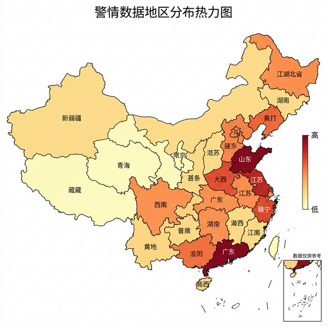

# 警情数据集文本分类

基于 fastText 算法对警情报告文本进行自动分类。警情数据包含各类报警记录（盗窃、诈骗、交通事故、火灾等），通过自然语言处理技术对警情描述进行预处理和特征提取，训练文本分类模型实现业务类别的自动识别。同时提供地区分布可视化分析。

## 痛点与目的

- **问题**：大量警情报告需要人工分类归档，效率低且分类标准不统一
- **方案**：用 fastText 训练文本分类模型，对警情描述自动分类
- **效果**：实现警情文本的自动分类和地区分布可视化分析

## 分析结果



## 核心功能

- **数据预处理**：合并多源 Excel 数据，清洗文本，去除停用词
- **fastText 训练**：基于 fastText 算法训练文本分类模型
- **分类预测**：对新警情文本自动预测类别
- **地区可视化**：生成警情地区分布热力图
- **Web 测试**：Flask 接口提供在线预测服务

## 使用方法

### 1. 数据预处理

```bash
python hebin_xlsx.py    # 合并 Excel 数据
python qinxi_data.py    # 清洗数据
```

### 2. 训练模型

```bash
python fastText_training.py
```

### 3. 测试预测

```bash
python web_test.py
```

## 项目结构

```
.
├── fastText_training.py      # fastText 模型训练
├── hebin_xlsx.py              # Excel 数据合并
├── qinxi_data.py              # 数据清洗
├── web_test.py                # Flask 测试接口
├── cn_stopwords.txt           # 中文停用词表
├── data/
│   ├── train_data.txt         # 训练数据
│   └── test_data.txt          # 测试数据
├── X_train.xlsx / y_train.xlsx  # 训练集
├── X_test.xlsx / y_test.xlsx    # 测试集
├── region_map.html            # 地区分布图
└── region_map.png             # 地区分布截图
```

## 技术栈

| 组件 | 技术 |
|------|------|
| 语言 | Python |
| 分类算法 | fastText |
| 数据处理 | pandas, jieba |
| 可视化 | pyecharts |
| Web | Flask |

## 许可证

MIT 许可证
